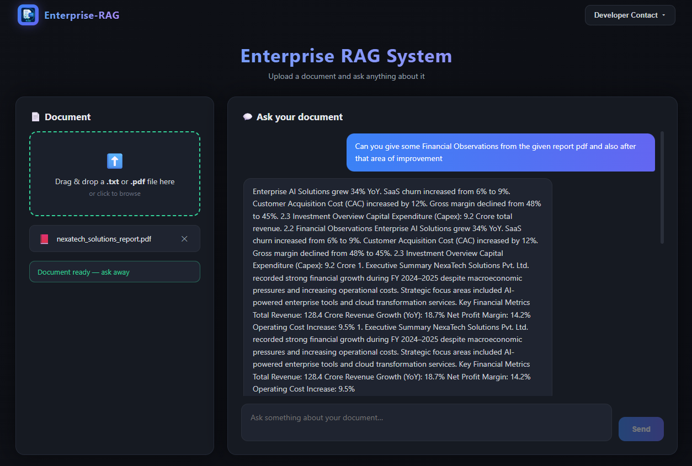
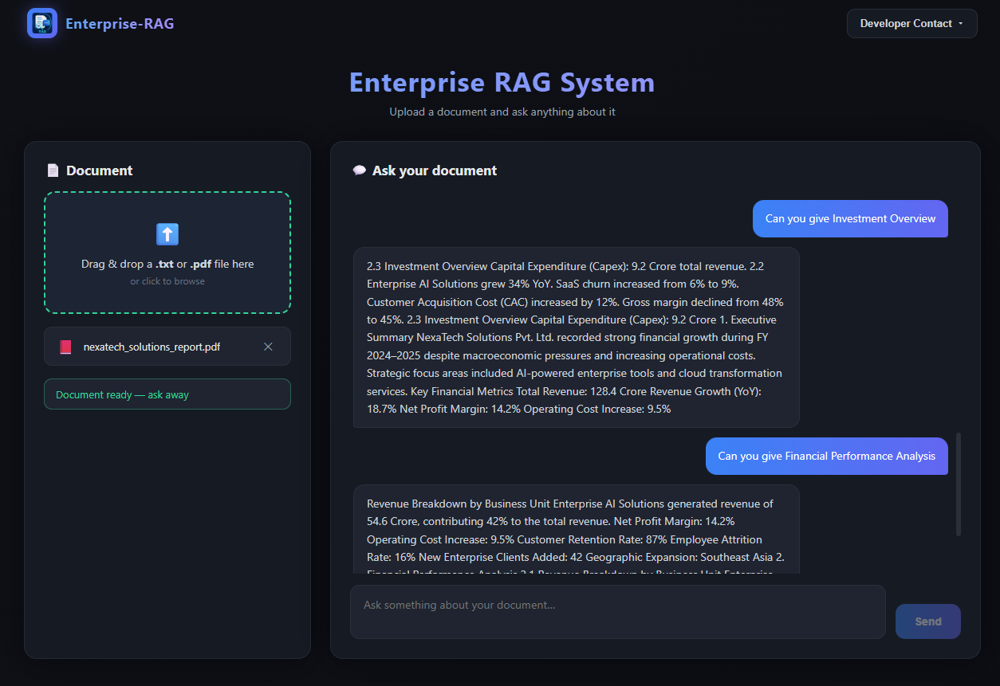

# 🏢 Enterprise Document Intelligence System (RAG)

An enterprise-level Retrieval-Augmented Generation (RAG) system built using LangChain, FastAPI, and HuggingFace models — with a React chat interface that lets you **upload your own documents and ask questions about them in real time**.

This project simulates how companies can securely analyze private internal documents (reports, strategy docs, performance reviews, contracts) and get grounded, context-only answers — entirely on local/open-source models, with no data leaving the system.

---

## 📸 Screenshots

<p align="center">
  
</p>

<p align="center">
  
</p>

---

## 🚀 Features

- 📤 **Upload your own document** — drag & drop or browse for a `.txt` or `.pdf` file directly from the UI
- 💬 **Chat-style interface** — ask follow-up questions in a conversation view, not a single static box
- ⚡ **Dynamic ingestion** — every uploaded document is chunked, embedded, and indexed on the fly; questions are answered strictly from *that* document
- 🧩 Automatic format detection (TXT vs PDF) with the appropriate loader
- 🔍 Retrieval-based question answering grounded only in the uploaded content (no hallucinated external knowledge)
- 📊 Structured answer format — **Key Facts / Supporting Data / Conclusion**
- 🗄 Local vector database (Chroma) — nothing sent to third-party APIs

---

## 🧠 Tech Stack

**Backend**
- Python, FastAPI
- LangChain (`langchain-community`, `langchain-chroma`, `langchain-huggingface`)
- HuggingFace Transformers — `google/flan-t5-base` (local text generation)
- Sentence Transformers — `all-MiniLM-L6-v2` (embeddings)
- ChromaDB (local vector database)
- `pypdf` (PDF parsing)

**Frontend**
- React (Create React App)
- Chat-style UI with file upload, send button, and live answer rendering

---

## 📂 Architecture / Flow

```
User uploads document (.txt or .pdf)
   → Loader picks the right parser (TextLoader / PyPDFLoader)
   → RecursiveCharacterTextSplitter (chunking)
   → MiniLM Embeddings
   → Chroma Vector Store (built fresh for the uploaded document)
   → Similarity Retriever (k=4)
   → Context-only Prompt Template
   → HuggingFace LLM (flan-t5-base)
   → Structured Answer
   → Displayed in the React Chat UI
```

---

## 🛠 Installation

**Backend**
```bash
cd backend
pip install -r requirements.txt
```

`requirements.txt` includes: `fastapi`, `uvicorn`, `langchain`, `langchain-community`, `langchain-chroma`, `langchain-huggingface`, `transformers`, `chromadb`, `sentence-transformers`, `pypdf`

**Frontend**
```bash
cd frontend
npm install
```

---

## ▶️ Running the Project

**1. Start the backend (FastAPI)**
```bash
cd backend
uvicorn main:app --reload
```
Runs at: `http://127.0.0.1:8000`

**2. Start the frontend (React)**
```bash
cd frontend
npm start
```
Runs at: `http://localhost:3000`

**3. Use it**
- Open `http://localhost:3000` in your browser
- Upload a `.txt` or `.pdf` document
- Wait for it to be processed/indexed
- Ask questions about it in the chat — answers are generated strictly from your uploaded document

---

## 🔌 API Reference

| Endpoint | Method | Description |
|---|---|---|
| `/upload` | `POST` | Accepts a `.txt` or `.pdf` file, ingests it, and builds a retriever for it |
| `/ask` | `POST` | Accepts `{ "question": "..." }` and returns a context-grounded answer from the most recently uploaded document |
